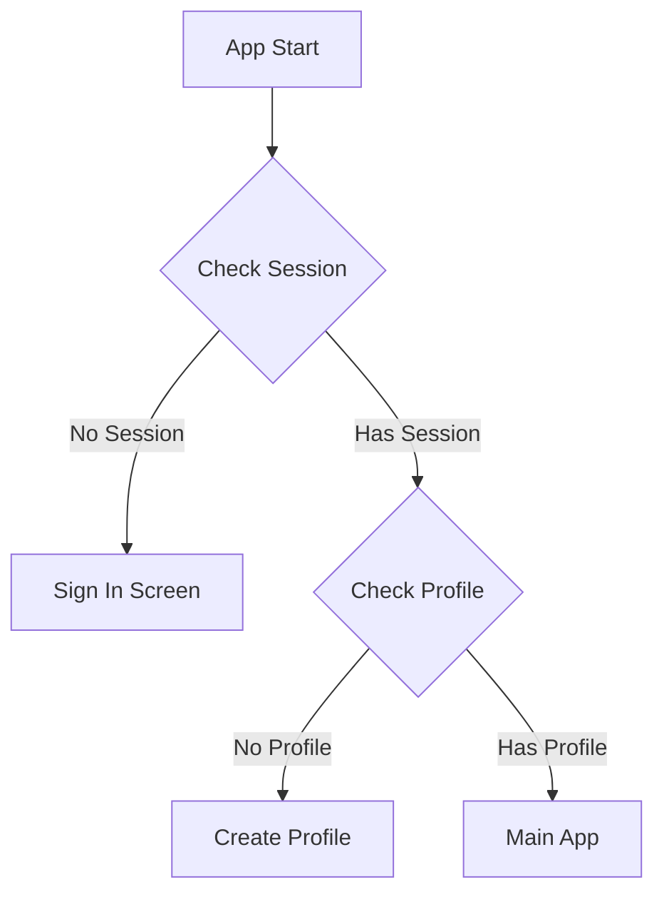
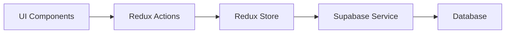

# Tracker - Health & Nutrition Tracking Application
## React Native Implementation Guide

## Table of Contents
1. Project Overview
2. Core User Stories
3. Onboarding Flow
4. System Architecture
5. Frontend Components
6. Data Management
7. Backend Integration
8. Development Setup
9. React Native Implementation Guide
10. Performance Considerations

## 1. Project Overview

### Project Purpose
Tracker is a comprehensive health and nutrition tracking application designed to help users monitor their dietary intake, body metrics, and overall nutritional wellness. The application provides detailed insights into food consumption patterns, nutritional quality scoring, and body mass index (BMI) tracking.

### Core Features
- Food entry tracking and management
- BMI calculation and monitoring
- Nutrition quality scoring system
- Daily food intake visualization
- Profile management
- Detailed nutritional insights
- AI-powered meal recognition and logging
- Smart nutrition insights and recommendations
- Subscription-based premium features
- Comprehensive onboarding experience

### 1.3 Technical Stack (React Native Implementation)
- **Frontend Framework**: 
  - React Native with TypeScript
  - Expo SDK (latest stable)
  - Expo Router for navigation
  - Expo Updates for OTA updates
  - Expo Notifications

- **UI Framework**: 
  - React Native Paper
  - Custom theme extension
  - Material Design 3 guidelines
  - Responsive components

- **Backend & Database**: 
  - Supabase
    - PostgreSQL database
    - Real-time subscriptions
    - Row Level Security
    - Storage for media
    - Authentication
    - Edge Functions

- **AI Integration**: 
  - OpenAI GPT-4 Vision
  - OpenAI GPT-4
  - DeepSeek for fallback/optimization
  - Custom prompt engineering
  - Rate limiting and quota management

- **Development Tools**:
  - Expo Dev Client
  - TypeScript strict mode
  - ESLint + Prettier
  - Husky for git hooks
  - Jest for testing

- **Analytics & Monitoring**:
  - Mixpanel/Amplitude
  - Sentry for error tracking
  - Performance monitoring
  - User session recording

- **Subscription Management**: 
  - RevenueCat
  - In-app purchases
  - Subscription tracking
  - Cross-platform sync

- **Type Safety**: 
  - TypeScript with strict mode
  - Zod for runtime validation
  - Type generation for Supabase
  - API type safety

### 1.4 Architecture Overview
The application follows a modern React Native architecture with:
- Expo-managed workflow
- Feature-first organization
- Atomic design methodology
- Type-safe implementation
- Clean Architecture principles
- Modular state management
- Custom theming system

### 1.5 Development Vision & Approach

Our development approach is guided by these key principles:

#### Pragmatic Feature Development
- **Faster Time to Market**: Prioritize core features that deliver immediate value to users
- **Real-World Driven**: Shape components and features based on actual user needs and usage patterns
- **Efficient Development**: Focus development time on features that matter most to users
- **Natural Evolution**: Allow the component library and features to evolve naturally with the application
- **Avoid Over-Engineering**: Start simple and enhance based on real requirements

#### Implementation Strategy
1. **Component Development**
   - Build components as needed for specific features
   - Refactor and abstract common patterns after multiple use cases
   - Maintain flexibility for future requirements
   - Focus on reusability without premature abstraction

2. **Feature Implementation**
   - Start with core user journeys
   - Implement MVP functionality first
   - Iterate based on usage and feedback
   - Add enhancements progressively

3. **Technical Architecture**
   - Begin with simple, solid foundations
   - Add complexity only when justified
   - Keep architecture flexible for future changes
   - Focus on maintainability and scalability

4. **Testing Approach**
   - Prioritize tests for stable, core functionality
   - Add tests as features mature
   - Focus on critical user paths
   - Avoid testing temporary implementations

#### Success Metrics
- Speed of feature delivery
- User satisfaction with core features
- Code maintainability
- Development efficiency
- Quality of user experience

## 1.1 Core User Stories

### Food Tracking
- As a user, I can manually add food entries with name, calories, and meal category
- As a user, I can search for foods in an external database that pre-fills nutritional information
- As a user, I can edit the amount of food in grams/ml and see updated nutritional values
- As a user, I can categorize food entries into different meal categories (breakfast, lunch, dinner, snacks)
- As a user, I can view my daily food entries organized by meal categories
- As a user, I can edit or delete existing food entries through a consistent modal interface
- As a user, I can access the edit/delete modal from any view showing food entries
- As a user, I can set and track my daily calorie goals
- As a user, I can use AI-powered chat to log my meals using natural language
- As a user, I can upload food photos for automatic recognition and logging
- As a user, I can save favorite meals for quick logging
- As a user, I can use meal templates for common combinations (premium)

### Profile Management
- As a user, I can set and update my profile information (weight, height, birth date)
- As a user, I can set and track my target weight
- As a user, I can view my BMI calculation and detailed BMI information
- As a user, I can update my measurements at any time
- As a user, I can view my age calculated from my birth date
- As a user, I can set my dietary preferences and restrictions
- As a user, I can customize my daily macro and micronutrient goals
- As a user, I can track my progress with before/after photos (premium)

### Nutrition Insights
- As a user, I can view detailed nutritional information for each food item
- As a user, I can see a nutrition quality score (0-100) for my food entries
- As a user, I can view macronutrient breakdowns (protein, carbs, fat, fiber)
- As a user, I can see progress bars for daily nutrient goals
- As a user, I can view weekly calorie intake trends
- As a user, I can receive AI-powered weekly nutrition insights
- As a user, I can get personalized meal suggestions based on my goals
- As a user, I can access advanced analytics and trends (premium)
- As a user, I can export my nutrition data (premium)

### Home Screen Experience
- As a user, I can view my daily calorie and macro progress at a glance
- As a user, I can quickly add meals through multiple entry methods
- As a user, I can see my recent meals and frequent choices
- As a user, I can view my daily nutrition score
- As a user, I can access quick actions for logging and tracking
- As a user, I can see my weight tracking progress
- As a user, I can view my upcoming meal schedule (premium)

### AI Assistant Features
- As a user, I can add food entries through natural language description
- As a user, I can upload food photos for automatic recognition and logging
- As a user, I can receive AI-powered weekly nutrition insights
- As a user, I can get personalized meal suggestions based on my goals
- As a user, I can interact with AI to clarify food entries and portions
- As a user, I can receive smart notifications and reminders
- As a user, I can get AI-powered recipe suggestions (premium)
- As a user, I can receive personalized coaching tips (premium)

### Premium Features
- As a premium user, I have unlimited AI food recognition attempts
- As a premium user, I receive detailed nutrition insights and recommendations
- As a premium user, I can access advanced progress analytics
- As a premium user, I can export my data in various formats
- As a premium user, I can create and share custom meal templates
- As a premium user, I can access meal planning features
- As a premium user, I can receive personalized coaching
- As a premium user, I can sync with additional health apps and devices

### Authentication & Onboarding
- As a user, I can sign up using email, Google, or Apple authentication
- As a user, I can complete a comprehensive onboarding process
- As a user, I can save my progress during onboarding
- As a user, I can update my profile information at any time
- As a user, I can set my initial goals and preferences
- As a user, I can view a personalized app tour
- As a user, I can restore my previous data when reinstalling

## 2. Onboarding Flow

The app features a comprehensive onboarding process designed to collect essential user information while maintaining high engagement through a conversational interface. The flow consists of 26 carefully crafted steps that guide users from initial signup to their personalized plan.

### Key Features
- Progressive data collection with single-focus screens
- Personalized goal setting and timeline planning
- AI-driven progress projections and comparisons
- Interactive visualizations and engaging UI elements
- Comprehensive user profiling (demographics, goals, habits)

### Data Collection Categories
- User Demographics
- Physical Metrics
- Lifestyle Preferences
- Goal Setting
- Personal Challenges
- Marketing Attribution

### Technical Considerations
- Real-time input validation
- Progress persistence
- Offline support
- Analytics integration
- Seamless back navigation

For detailed specifications of each onboarding step, UI elements, and implementation requirements, refer to [Onboarding Flow Specification](./Onboardingspecs.md).

## 3. System Architecture

### 3.1 Component Breakdown

1. **Core Navigation Sections**
   
   #### Main View (HomeView)
   Primary view combining daily tracking and insights
   - Daily nutrition summary and progress
   - Meal category breakdowns
   - Recent meals history
   - Weekly trends visualization
   - Progress indicators
   - Goal tracking
   - Quick insights
   
   #### Profile Section (ProfileView)
   User profile and metrics management
   - Personal information
   - Body measurements
   - BMI tracking
   - Goal settings
   - Progress history
   - Achievement tracking
   
   #### History Section (HistoryView)
   Historical data and trends
   - Past entries log
   - Weekly/monthly summaries
   - Progress tracking
   - Trend analysis
   
   #### Settings Section (SettingsView)
   Application configuration and user preferences
   - User preferences
   - App settings
   - Notification preferences
   - Data management
   - Privacy settings
   - Subscription management
   - Export options

2. **Universal Food Entry System**

   #### Global Add Food Button
   - Floating action button accessible from all screens
   - Consistent position and styling
   - Premium feature indicators
   - Usage quota display (if applicable)

   #### Entry Method Selection
   Modal interface with four primary options:
   1. **Photo Recognition**
      - Camera interface with focus frame
      - Gallery selection option
      - Real-time processing indicator
      - Multi-item detection capability
      - Manual adjustment interface
   
   2. **Barcode Scanner**
      - Camera viewfinder with scan area
      - Manual code entry option
      - Recent scans history
      - Quick add to favorites
   
   3. **Text Entry**
      - AI-powered chat interface
      - Natural language processing
      - Manual form alternative
      - Recent entries suggestions
   
   4. **Food Library**
      - Categorized browsing
      - Favorites section
      - Recent items
      - Custom meals
      - Restaurant dishes

   #### Data Collection Flow
   Sequential process for all entry methods:
   1. **Source Selection**
      - Entry method choice
      - Context-based suggestions
      - Quick access to recent methods**
      - AI processing for photos/text
      - Database lookup for barcodes
      - Manual entry validation
      - Multi-item recognition
   
   3. **Entry Review & Editing**
      - Recognized items display
      - Portion adjustment
      - Nutritional information review
      - Multi-item grouping
      - Category selection
   
   4. **Confirmation & Saving**
      - Final review screen
      - Quick edit options
      - Save as custom meal option
      - Add to favorites option

3. **Universal Entry Management System**
   
   #### Entry Management Modal
   Accessible globally for editing and deleting entries
   - Trigger points:
     - Long press on entry
     - Edit button in entry detail
     - Context menu in entry list
   
   #### Modal Features
   - Full entry details display
   - Edit form with validation
   - Portion size adjustment
   - Category reassignment
   - Date/time modification
   - Nutritional info editing
   - Delete confirmation
   
   #### Edit History
   - Change tracking system
   - Version control
   - Undo/redo support
   - Audit logging
   
   #### State Management
   - Local state for form data
   - Global state updates
   - Optimistic updates
   - Error handling
   - Success confirmations

4. **Child Views**
   
   #### Settings Views
   - PreferencesView (User preferences)
     - Theme selection
     - Units configuration
     - Language settings
     - Notification settings
   
   - PrivacyView (Privacy and data)
     - Privacy policy
     - Data management
     - Export options
     - Account deletion
   
   - SubscriptionView (Premium features)
     - Plan comparison
     - Payment management
     - Feature access
     - Usage statistics

   #### Profile Management Views
   - ProfileEditView (Profile editing)
     - Personal info form
     - Measurements update
     - Goals configuration
     - Progress tracking
   
   - AchievementsView (User achievements)
     - Milestones display
     - Badges collection
     - Progress tracking
     - Rewards system

   #### Food Entry Views
   // ... existing food entry views ...

5. **Reusable Components**
   
   #### Entry Management Components
   - EntryDetailModal (Universal edit/delete modal)
     - Consistent interface across app
     - Form validation
     - Error handling
     - Success feedback
   
   - EntryEditForm (Edit functionality)
     - Dynamic form fields
     - Real-time validation
     - Nutritional calculations
     - Category selection
   
   - EditHistoryView (Version control)
     - Timeline display
     - Change details
     - Revert capabilities
     - Diff visualization
   
   #### Settings Components
   - SettingRow (Individual setting)
   - SettingGroup (Settings category)
   - ToggleOption (On/off setting)
   - SelectOption (Multiple choice setting)
   
   #### Profile Components
   - ProfileHeader (Profile summary)
   - StatsGrid (Metrics display)
   - ProgressChart (Progress visualization)
   - GoalCard (Goal tracking)
   
   #### Food Entry Components
   - FoodEntryCard (Entry display)
   - NutritionInfo (Nutrient breakdown)
   - PortionSelector (Amount adjustment)
   - CategoryPicker (Meal categorization)

## 4. Frontend Components

### Component Specifications

#### BMIInfoModal
```swift
Purpose: Displays detailed BMI information and calculation
Features:
- Interactive BMI scale visualization
- Detailed BMI range information
- Educational content about BMI
- Responsive layout with ScrollView
```

#### NutritionQualityScoreView
```swift
Purpose: Calculates and displays nutrition quality scores
Features:
- 100-point scoring system
- Circular progress indicator
- Quality level indicators (Excellent, Good, Fair, Poor)
- Detailed scoring breakdown
```

### UI/UX Patterns
1. **Color System**
   - Primary text color
   - Secondary text color
   - Card background
   - Theme-based colors for different states

2. **Layout Patterns**
   - Card-based design
   - Consistent padding and spacing
   - Responsive layouts
   - Modal presentations for detailed information

### Styling Approach
- Centralized theme management through AppTheme
- Consistent corner radius and spacing
- Hierarchical typography system
- Color-coded indicators for different states

## 5. Data Management

### Database Schema

#### Users Table
```sql
CREATE TABLE users (
  id UUID PRIMARY KEY DEFAULT uuid_generate_v4(),
  email TEXT UNIQUE NOT NULL,
  created_at TIMESTAMP WITH TIME ZONE DEFAULT NOW(),
  updated_at TIMESTAMP WITH TIME ZONE DEFAULT NOW(),
  profile_image_url TEXT,
  onboarding_completed BOOLEAN DEFAULT FALSE,
  subscription_status TEXT DEFAULT 'free',
  subscription_expires_at TIMESTAMP WITH TIME ZONE,
  notification_preferences JSONB DEFAULT '{}',
  last_login_at TIMESTAMP WITH TIME ZONE
);
```

#### User Profiles Table
```sql
CREATE TABLE user_profiles (
  id UUID PRIMARY KEY DEFAULT uuid_generate_v4(),
  user_id UUID REFERENCES users(id) ON DELETE CASCADE,
  name TEXT,
  gender TEXT,
  birth_date DATE,
  height DECIMAL,
  current_weight DECIMAL,
  target_weight DECIMAL,
  activity_level TEXT,
  dietary_preferences TEXT[],
  workout_frequency INTEGER,
  weight_goal TEXT,
  goal_timeline TEXT,
  obstacles TEXT[],
  created_at TIMESTAMP WITH TIME ZONE DEFAULT NOW(),
  updated_at TIMESTAMP WITH TIME ZONE DEFAULT NOW(),
  UNIQUE(user_id)
);
```

#### Food Entries Table
```sql
CREATE TABLE food_entries (
  id UUID PRIMARY KEY DEFAULT uuid_generate_v4(),
  user_id UUID REFERENCES users(id) ON DELETE CASCADE,
  name TEXT NOT NULL,
  calories DECIMAL NOT NULL,
  protein DECIMAL,
  carbs DECIMAL,
  fat DECIMAL,
  fiber DECIMAL,
  meal_category TEXT NOT NULL,
  portion_size DECIMAL,
  portion_unit TEXT,
  entry_date DATE NOT NULL,
  entry_time TIME NOT NULL,
  created_at TIMESTAMP WITH TIME ZONE DEFAULT NOW(),
  updated_at TIMESTAMP WITH TIME ZONE DEFAULT NOW(),
  ai_generated BOOLEAN DEFAULT FALSE,
  source TEXT,
  image_url TEXT
);
```

#### Weight History Table
```sql
CREATE TABLE weight_history (
  id UUID PRIMARY KEY DEFAULT uuid_generate_v4(),
  user_id UUID REFERENCES users(id) ON DELETE CASCADE,
  weight DECIMAL NOT NULL,
  recorded_at TIMESTAMP WITH TIME ZONE DEFAULT NOW(),
  note TEXT
);
```

#### Custom Foods Table
```sql
CREATE TABLE custom_foods (
  id UUID PRIMARY KEY DEFAULT uuid_generate_v4(),
  user_id UUID REFERENCES users(id) ON DELETE CASCADE,
  name TEXT NOT NULL,
  calories DECIMAL NOT NULL,
  protein DECIMAL,
  carbs DECIMAL,
  fat DECIMAL,
  fiber DECIMAL,
  portion_size DECIMAL,
  portion_unit TEXT,
  barcode TEXT UNIQUE,
  created_at TIMESTAMP WITH TIME ZONE DEFAULT NOW(),
  updated_at TIMESTAMP WITH TIME ZONE DEFAULT NOW()
);
```

#### Food Categories Table
```sql
CREATE TABLE food_categories (
  id UUID PRIMARY KEY DEFAULT uuid_generate_v4(),
  name TEXT NOT NULL,
  icon TEXT,
  created_at TIMESTAMP WITH TIME ZONE DEFAULT NOW()
);
```

#### AI Processing History Table
```sql
CREATE TABLE ai_processing_history (
  id UUID PRIMARY KEY DEFAULT uuid_generate_v4(),
  user_id UUID REFERENCES users(id) ON DELETE CASCADE,
  input_type TEXT NOT NULL,
  input_data TEXT,
  result JSONB,
  processed_at TIMESTAMP WITH TIME ZONE DEFAULT NOW(),
  success BOOLEAN DEFAULT TRUE,
  error_message TEXT
);
```

#### User Goals Table
```sql
CREATE TABLE user_goals (
  id UUID PRIMARY KEY DEFAULT uuid_generate_v4(),
  user_id UUID REFERENCES users(id) ON DELETE CASCADE,
  goal_type TEXT NOT NULL,
  target_value DECIMAL,
  start_date DATE NOT NULL,
  target_date DATE,
  status TEXT DEFAULT 'active',
  progress DECIMAL DEFAULT 0,
  created_at TIMESTAMP WITH TIME ZONE DEFAULT NOW(),
  updated_at TIMESTAMP WITH TIME ZONE DEFAULT NOW()
);
```

### Folder Structure

```
tracker/
├── src/
│   ├── app/                    # App entry points and navigation
│   │   ├── _layout.tsx         # Root layout
│   │   ├── (auth)/            # Authentication routes
│   │   ├── (main)/            # Main app routes
│   │   └── (modals)/          # Modal routes
│   │
│   ├── features/              # Feature-based modules
│   │   ├── food/             # Food tracking feature
│   │   │   ├── components/   # Feature components
│   │   │   ├── hooks/        # Feature hooks
│   │   │   ├── screens/      # Feature screens
│   │   │   ├── services/     # Feature services
│   │   │   └── types.ts      # Feature types
│   │   │
│   │   ├── profile/          # Profile management
│   │   ├── insights/         # Nutrition insights
│   │   └── settings/         # App settings
│   │
│   ├── core/                 # Core application code
│   │   ├── components/       # Shared UI components
│   │   │   ├── buttons/
│   │   │   ├── cards/
│   │   │   ├── forms/
│   │   │   ├── modals/
│   │   │   └── typography/
│   │   │
│   │   ├── hooks/           # Shared hooks
│   │   ├── services/        # Core services
│   │   │   ├── api/
│   │   │   ├── storage/
│   │   │   └── analytics/
│   │   │
│   │   └── utils/           # Utility functions
│   │
│   ├── lib/                 # Third-party integrations
│   │   ├── supabase.ts
│   │   ├── openai.ts
│   │   └── revenuecat.ts
│   │
│   ├── providers/          # Context providers
│   │   ├── auth/
│   │   ├── theme/
│   │   └── subscription/
│   │
│   ├── store/             # Global state management
│   │   ├── slices/
│   │   └── hooks.ts
│   │
│   ├── theme/             # Theming system
│   │   ├── colors.ts
│   │   ├── spacing.ts
│   │   └── typography.ts
│   │
│   └── types/             # Global type definitions
│
├── assets/               # Static assets
│   ├── fonts/
│   ├── images/
│   └── icons/
│
├── tests/               # Test files
│   ├── unit/
│   ├── integration/
│   └── e2e/
│
└── docs/               # Documentation
    ├── api/
    ├── components/
    └── features/
```

### Database Relationships

1. **One-to-One Relationships**
   - User ↔ UserProfile
   - User ↔ SubscriptionStatus

2. **One-to-Many Relationships**
   - User → FoodEntries
   - User → WeightHistory
   - User → CustomFoods
   - User → AIProcessingHistory
   - User → UserGoals

3. **Many-to-Many Relationships**
   - Users ↔ FoodCategories (through CustomFoods)

### Data Access Patterns

1. **Common Queries**
```sql
-- Get user's daily food entries
SELECT * FROM food_entries
WHERE user_id = :user_id
AND entry_date = :date
ORDER BY entry_time;

-- Get user's weight history
SELECT * FROM weight_history
WHERE user_id = :user_id
ORDER BY recorded_at DESC
LIMIT 30;

-- Get user's custom foods
SELECT * FROM custom_foods
WHERE user_id = :user_id
ORDER BY name;
```

2. **Indexes**
```sql
-- Food entries indexes
CREATE INDEX idx_food_entries_user_date 
ON food_entries(user_id, entry_date);

-- Weight history index
CREATE INDEX idx_weight_history_user 
ON weight_history(user_id, recorded_at);

-- Custom foods index
CREATE INDEX idx_custom_foods_user 
ON custom_foods(user_id);
```

3. **Row Level Security**
```sql
-- Enable RLS
ALTER TABLE users ENABLE ROW LEVEL SECURITY;
ALTER TABLE food_entries ENABLE ROW LEVEL SECURITY;

-- Create policies
CREATE POLICY "Users can view own data" ON users
FOR SELECT USING (auth.uid() = id);

CREATE POLICY "Users can insert own food entries" ON food_entries
FOR INSERT WITH CHECK (auth.uid() = user_id);
```

## 6. Features & Implementation

### Core Calculations

#### BMI Calculation System
- Formula: BMI = weight (kg) / (height (m))²
- Implementation details:
  ```typescript
  function calculateBMI(weight: number, height: number): number {
    const heightInMeters = height / 100;
    return weight / (heightInMeters * heightInMeters);
  }
  ```
- Range categorization:
  ```typescript
  function getBMICategory(bmi: number): BMIRange {
    if (bmi < 18.5) return 'underweight';
    if (bmi < 25) return 'healthy';
    if (bmi < 30) return 'overweight';
    return 'obese';
  }
  ```

#### Nutrition Quality Scoring
Scoring algorithm implementation:
```typescript
function calculateNutritionScore(nutrients: Nutrients, calories: number): number {
  let score = 0;
  
  // Protein quality (0-30 points)
  const proteinPerCalorie = (nutrients.protein * 4) / calories;
  score += Math.min(Math.max(proteinPerCalorie * 100, 0), 30);
  
  // Fiber quality (0-20 points)
  const fiberPer1000Cal = (nutrients.fiber / calories) * 1000;
  score += Math.min(Math.max(fiberPer1000Cal * 5, 0), 20);
  
  // Macronutrient balance (0-30 points)
  const carbsPercent = (nutrients.carbs * 4) / calories;
  const proteinPercent = (nutrients.protein * 4) / calories;
  const fatPercent = (nutrients.fat * 9) / calories;
  
  if (carbsPercent >= 0.45 && carbsPercent <= 0.65) score += 10;
  if (proteinPercent >= 0.10 && proteinPercent <= 0.35) score += 10;
  if (fatPercent >= 0.20 && fatPercent <= 0.35) score += 10;
  
  // Overall balance bonus (0-20 points)
  if (score >= 60) score += 20;
  else if (score >= 40) score += 10;
  
  return Math.min(score, 100);
}
```

### UI Components Implementation

#### Progress Indicators
1. **Circular Progress**
```typescript
interface CircularProgressProps {
  progress: number;  // 0 to 1
  size?: number;     // diameter in pixels
  strokeWidth?: number;
  color: string;
  backgroundColor?: string;
}

// Implementation using react-native-svg
function CircularProgress({
  progress,
  size = 100,
  strokeWidth = 10,
  color,
  backgroundColor = '#E5E5EA'
}: CircularProgressProps) {
  const radius = (size - strokeWidth) / 2;
  const circumference = radius * 2 * Math.PI;
  const strokeDashoffset = circumference - (progress * circumference);

  return (
    <Svg width={size} height={size}>
      {/* Background circle */}
      <Circle
        cx={size / 2}
        cy={size / 2}
        r={radius}
        stroke={backgroundColor}
        strokeWidth={strokeWidth}
      />
      {/* Progress circle */}
      <Circle
        cx={size / 2}
        cy={size / 2}
        r={radius}
        stroke={color}
        strokeWidth={strokeWidth}
        strokeDasharray={`${circumference} ${circumference}`}
        strokeDashoffset={strokeDashoffset}
      />
    </Svg>
  );
}
```

2. **Nutrition Progress Bars**
```typescript
interface NutritionBarProps {
  nutrient: string;
  current: number;
  target: number;
  color: string;
}

function NutritionBar({
  nutrient,
  current,
  target,
  color
}: NutritionBarProps) {
  const progress = Math.min(current / target, 1);
  
  return (
    <View style={styles.container}>
      <Text style={styles.label}>{nutrient}</Text>
      <View style={styles.barContainer}>
        <View 
          style={[
            styles.progressBar,
            { width: `${progress * 100}%`, backgroundColor: color }
          ]}
        />
      </View>
      <Text style={styles.value}>{`${current}/${target}g`}</Text>
    </View>
  );
}
```

### Interactive Features

#### BMI Scale Visualization
Implementation of the interactive BMI scale with current value indicator:
```typescript
function BMIScale({ currentBMI }: { currentBMI: number }) {
  const ranges = [
    { label: 'Underweight', color: '#FFD60A', range: '<18.5' },
    { label: 'Healthy', color: '#30D158', range: '18.5-24.9' },
    { label: 'Overweight', color: '#FF9F0A', range: '25-29.9' },
    { label: 'Obese', color: '#FF453A', range: '≥30' }
  ];
  
  const position = calculateIndicatorPosition(currentBMI);
  
  return (
    <View style={styles.container}>
      <View style={styles.scaleContainer}>
        {ranges.map(range => (
          <View
            key={range.label}
            style={[styles.rangeBar, { backgroundColor: range.color }]}
          />
        ))}
      </View>
      <View style={[styles.indicator, { left: `${position}%` }]} />
      <View style={styles.labels}>
        {ranges.map(range => (
          <Text key={range.label} style={styles.rangeLabel}>
            {range.range}
          </Text>
        ))}
      </View>
    </View>
  );
}
```

### AI Integration

#### OpenAI Configuration
```typescript
interface AIConfig {
  model: 'gpt-4-vision-preview' | 'gpt-4'
  temperature: number
  maxTokens: number
  rateLimit: {
    free: {
      requestsPerHour: 30
      requestsPerMonth: 100
    }
    premium: {
      requestsPerHour: 100
      requestsPerMonth: 500
    }
  }
}
```

#### Food Recognition Flow
```typescript
async function processAIFoodEntry(
  input: string | File,
  type: 'text' | 'photo'
): Promise<FoodEntry> {
  // Rate limiting check
  if (!checkUserQuota(userId)) {
    throw new QuotaExceededError()
  }

  // Process with OpenAI
  const aiResponse = await openai.createCompletion({
    model: type === 'photo' ? 'gpt-4-vision-preview' : 'gpt-4',
    messages: generatePrompt(input, type)
  })

  // Parse response
  const foodItems = parseAIResponse(aiResponse)

  // Create food entry
  return createFoodEntry({
    items: foodItems,
    type: foodItems.length > 1 ? 'multi' : 'single',
    aiGenerated: true,
    source: type,
    originalInput: { [type]: input }
  })
}
```

### Subscription Management

#### RevenueCat Integration
```typescript
interface SubscriptionPlans {
  free: {
    features: string[]
    limits: {
      aiRequests: number
      dataExport: boolean
      insights: 'basic'
    }
  }
  premium: {
    price: {
      monthly: number
      annual: number
    }
    features: string[]
    limits: {
      aiRequests: number
      dataExport: boolean
      insights: 'advanced'
    }
  }
}
```

### Authentication Flow

#### Supabase Implementation
```typescript
const supabase = createClient(
  process.env.SUPABASE_URL,
  process.env.SUPABASE_ANON_KEY
)

async function signInWithProvider(
  provider: 'google' | 'apple' | 'email'
) {
  const { user, session, error } = await supabase.auth.signIn({
    provider
  })

  if (error) throw error

  // Initialize user profile
  await initializeUserProfile(user.id)
  
  // Start onboarding if new user
  if (user.app_metadata.is_new_user) {
    navigateToOnboarding()
  }
}
```

## 7. Backend Integration

### External API Integration

#### USDA Food Database API
The application uses the USDA Food Data Central (FDC) API for comprehensive nutritional information:

1. **API Setup**
   - Sign up for an API key at https://fdc.nal.usda.gov/
   - Store the API key securely in environment variables
   - Base URL: `https://api.nal.usda.gov/fdc/v1`

2. **API Endpoints**
   ```
   /foods/search - Search food items
   /food/{fdcId} - Get detailed food information
   ```

3. **Authentication**
   - API Key required as URL parameter: `api_key=YOUR_API_KEY`
   - Register at https://fdc.nal.usda.gov/api-key-signup.html

4. **Search Parameters**
   ```json
   {
     "query": "string",
     "dataType": ["Survey (FNDDS)", "Foundation", "SR Legacy"],
     "pageSize": number,
     "pageNumber": number,
     "sortBy": "dataType.keyword",
     "sortOrder": "asc"
   }
   ```

5. **Response Format**
   ```json
   {
     "totalHits": number,
     "currentPage": number,
     "totalPages": number,
     "foods": [{
       "fdcId": number,
       "description": "string",
       "brandOwner": "string",
       "ingredients": "string",
       "foodNutrients": [{
         "nutrientId": number,
         "nutrientName": "string",
         "value": number,
         "unitName": "string"
       }]
     }]
   }
   ```

6. **Implementation Notes**
   - Free tier: 3,600 API calls per hour
   - Recommended: Implement local caching
   - Response data requires mapping to app's data model
   - Handle rate limiting with exponential backoff

## 8. Development Setup

### Environment Setup
```bash
# Install dependencies
npm install

# Environment variables
SUPABASE_URL=your_supabase_url
SUPABASE_ANON_KEY=your_supabase_key
OPENAI_API_KEY=your_openai_key
REVENUECAT_PUBLIC_KEY=your_revenuecat_key

# Start development server
npm run dev
```

## 9. React Native Implementation Guide

### 9.1 Project Architecture

#### Core Architecture Principles
- Clean Architecture approach
- Feature-first organization
- Atomic design methodology
- Type-safe implementation
- Testable code structure

#### Project Structure
```
src/
├── features/          # Feature-based modules
│   ├── food/         # Food tracking feature
│   │   ├── components/   # Feature components
│   │   ├── hooks/        # Feature hooks
│   │   ├── screens/      # Feature screens
│   │   ├── services/     # Feature services
│   │   └── types.ts      # Feature types
│   │
│   ├── profile/      # Profile management
│   ├── insights/     # Nutrition insights
│   └── settings/     # App settings
│
├── core/             # Core application code
│   ├── components/   # Shared UI components
│   │   ├── buttons/
│   │   ├── cards/
│   │   ├── forms/
│   │   ├── modals/
│   │   └── typography/
│   │
│   ├── hooks/        # Shared hooks
│   ├── services/     # Core services
│   │   ├── api/
│   │   ├── storage/
│   │   └── analytics/
│   │
│   └── utils/        # Utility functions
│
├── lib/                 # Third-party integrations
│   ├── supabase.ts
│   ├── openai.ts
│   └── revenuecat.ts
│
├── providers/          # Context providers
│   ├── auth/
│   ├── theme/
│   └── subscription/
│
├── store/             # Global state management
│   ├── slices/
│   └── hooks.ts
│
├── theme/             # Theming system
│   ├── colors.ts
│   ├── spacing.ts
│   └── typography.ts
│
└── types/             # Global type definitions
```

#### Feature Module Structure
```
feature/
├── components/     # Feature-specific components
├── screens/        # Feature screens
├── hooks/          # Feature-specific hooks
├── services/       # Feature-specific services
├── types/          # Feature-specific types
└── state/          # Feature state management
```

### 9.2 Development Standards

#### TypeScript Best Practices
```typescript
// Strict type checking
{
  "compilerOptions": {
    "strict": true,
    "noImplicitAny": true,
    "strictNullChecks": true,
    "strictFunctionTypes": true
  }
}

// Type-safe component props
interface Props {
  data: FoodEntry;
  onUpdate: (entry: FoodEntry) => Promise<void>;
  isLoading?: boolean;
}

// Type-safe hooks
function useFoodEntry(id: string) {
  return useQuery<FoodEntry, Error>(['food', id], 
    () => getFoodEntry(id)
  );
}
```

#### State Management
```typescript
// Redux Toolkit slice
import { createSlice, PayloadAction } from '@reduxjs/toolkit';

const foodSlice = createSlice({
  name: 'food',
  initialState,
  reducers: {
    addEntry: (state, action: PayloadAction<FoodEntry>) => {
      state.entries.push(action.payload);
    },
    updateEntry: (state, action: PayloadAction<FoodEntry>) => {
      const index = state.entries.findIndex(
        entry => entry.id === action.payload.id
      );
      if (index !== -1) {
        state.entries[index] = action.payload;
      }
    }
  }
});
```

### 9.3 UI Implementation

#### Component Architecture
```typescript
// Base component with composition
const FoodEntryCard: React.FC<FoodEntryCardProps> = ({
  entry,
  onEdit,
  onDelete
}) => {
  return (
    <Card>
      <EntryHeader entry={entry} />
      <EntryDetails nutrients={entry.nutrients} />
      <EntryActions onEdit={onEdit} onDelete={onDelete} />
    </Card>
  );
};

// Styled component with theme
const Card = styled.View`
  background-color: ${({ theme }) => theme.colors.card};
  border-radius: ${({ theme }) => theme.borderRadius.medium}px;
  padding: ${({ theme }) => theme.spacing.medium}px;
  elevation: 2;
`;
```

#### Navigation Setup
```typescript
// Type-safe navigation
type RootStackParamList = {
  Home: undefined;
  FoodEntry: { id?: string };
  Profile: undefined;
  Settings: undefined;
};

const Stack = createNativeStackNavigator<RootStackParamList>();

function AppNavigator() {
  return (
    <Stack.Navigator>
      <Stack.Screen name="Home" component={HomeScreen} />
      <Stack.Screen name="FoodEntry" component={FoodEntryScreen} />
      <Stack.Screen name="Profile" component={ProfileScreen} />
      <Stack.Screen name="Settings" component={SettingsScreen} />
    </Stack.Navigator>
  );
}
```

### 9.4 API Integration

#### Service Layer Pattern
```typescript
// API service with type safety
class FoodService {
  async searchFood(query: string): Promise<FoodSearchResult> {
    const response = await this.api.get<FoodSearchResponse>(
      '/foods/search',
      { params: { query } }
    );
    return this.mapSearchResponse(response.data);
  }

  async getFoodDetails(id: string): Promise<FoodDetails> {
    const response = await this.api.get<FoodDetailsResponse>(
      `/food/${id}`
    );
    return this.mapFoodDetails(response.data);
  }
}
```

#### Error Handling
```typescript
// Global error handling
interface ApiError {
  code: string;
  message: string;
  details?: unknown;
}

class ApiErrorHandler {
  handle(error: unknown): ApiError {
    if (axios.isAxiosError(error)) {
      return {
        code: error.response?.status.toString() || 'UNKNOWN',
        message: error.message,
        details: error.response?.data
      };
    }
    return {
      code: 'UNKNOWN',
      message: 'An unexpected error occurred'
    };
  }
}
```

### 9.5 Testing Strategy

#### Component Testing
```typescript
// Component test example
describe('FoodEntryCard', () => {
  it('renders food entry details correctly', () => {
    const entry = mockFoodEntry();
    const { getByText } = render(<FoodEntryCard entry={entry} />);
    
    expect(getByText(entry.name)).toBeTruthy();
    expect(getByText(`${entry.calories} kcal`)).toBeTruthy();
  });

  it('handles edit action', () => {
    const onEdit = jest.fn();
    const { getByTestId } = render(
      <FoodEntryCard entry={mockFoodEntry()} onEdit={onEdit} />
    );
    
    fireEvent.press(getByTestId('edit-button'));
    expect(onEdit).toHaveBeenCalled();
  });
});
```

### 9.6 Performance Optimization

#### List Rendering
```typescript
// Optimized list rendering
function FoodEntryList({ entries }: { entries: FoodEntry[] }) {
  const renderItem = useCallback(({ item }: { item: FoodEntry }) => (
    <FoodEntryCard entry={item} />
  ), []);

  const keyExtractor = useCallback((item: FoodEntry) => item.id, []);

  return (
    <FlashList
      data={entries}
      renderItem={renderItem}
      keyExtractor={keyExtractor}
      estimatedItemSize={100}
    />
  );
}
```

#### Image Optimization
```typescript
// Image loading and caching
function OptimizedImage({ uri, size }: { uri: string; size: number }) {
  return (
    <FastImage
      source={{ uri }}
      style={{ width: size, height: size }}
      resizeMode={FastImage.resizeMode.cover}
      cacheControl={FastImage.cacheControl.immutable}
    />
  );
}
```

## 10. Performance Considerations

### AI Request Optimization
- Implement request debouncing
- Cache similar queries
- Batch process photo recognition
- Implement progressive loading for chat history

### Theme Performance
- Precompile theme variants
- Memoize styled components
- Implement efficient theme switching
- Cache computed styles

### Authentication & Onboarding
- Implement progressive loading
- Cache onboarding progress
- Optimize image assets
- Implement step preloading

## 11. Onboarding Flow

The app features a comprehensive onboarding process designed to collect essential user information while maintaining high engagement through a conversational interface. The flow consists of 26 carefully crafted steps that guide users from initial signup to their personalized plan.

### Key Features
- Progressive data collection with single-focus screens
- Personalized goal setting and timeline planning
- AI-driven progress projections and comparisons
- Interactive visualizations and engaging UI elements
- Comprehensive user profiling (demographics, goals, habits)

### Data Collection Categories
- User Demographics
- Physical Metrics
- Lifestyle Preferences
- Goal Setting
- Personal Challenges
- Marketing Attribution

### Technical Considerations
- Real-time input validation
- Progress persistence
- Offline support
- Analytics integration
- Seamless back navigation

For detailed specifications of each onboarding step, UI elements, and implementation requirements, refer to [Onboarding Flow Specification](./Onboardingspecs.md).

## Development Guidelines

### Logging Strategy
- **Purpose**: Enable effective testing, validation, and troubleshooting while maintaining code simplicity
- **Core Principles**:
  1. Log key lifecycle events (initialization, major state changes)
  2. Log important user interactions and their outcomes
  3. Log errors and edge cases
  4. Keep logging simple and meaningful

- **Logging Categories**:
  - 🚀 System: App lifecycle and initialization
  - 📱 UI: Major UI state changes and renders
  - 🧭 Navigation: Route changes and navigation events
  - 💾 Data: Important data operations
  - ❌ Errors: Error states and failures

- **Format Guidelines**:
  - Use emojis for quick visual categorization
  - Include timestamps for time-sensitive operations
  - Log objects with relevant context, not just messages
  - Avoid logging sensitive information

- **When to Log**:
  - Application startup and initialization
  - Navigation state changes
  - Important user interactions
  - Data operations success/failure
  - Error conditions and edge cases

## Authentication Performance Requirements

### Response Time Targets
- Sign In/Sign Up form submission: < 2 seconds
- Social authentication redirect: < 1 second
- Session validation: < 500ms
- Auto-login from stored credentials: < 1 second

### Error Handling Requirements

#### Authentication Errors
- Invalid credentials: Clear error message with recovery action
- Network failure: Retry mechanism with offline support
- Session expiration: Automatic renewal or graceful logout
- Social auth failures: Fallback to email/password

#### General Error Handling
1. User Feedback
   - Clear error messages in user-friendly language
   - Specific recovery actions when applicable
   - Progress preservation during errors
   - Offline state indication

2. Error Recovery
   - Automatic retry for network errors
   - Data preservation during crashes
   - Session recovery mechanisms
   - Form data persistence

3. Error Logging
   - Error type and timestamp
   - User context (non-identifiable)
   - Error stack trace
   - Recovery attempts

### Accessibility Requirements

#### Screen Reader Support
- Meaningful labels for all interactive elements
- Proper heading hierarchy
- Image descriptions
- Form field descriptions

#### Navigation
- Keyboard navigation support
- Focus management
- Skip links for repetitive content
- Logical tab order

#### Visual Accessibility
- Minimum contrast ratio: 4.5:1
- Adjustable text size
- No critical information conveyed by color alone
- Clear visual hierarchy

#### Input Methods
- Touch target size: minimum 44x44 points
- Sufficient spacing between interactive elements
- Multiple input method support
- Gesture alternatives

#### Feedback & Timing
- Error identification without relying on color
- Success feedback through multiple channels
- Adjustable timing for notifications
- Progress indicators for long operations

## Frontend Components

### Component Development Standards
All core components must follow our established development pattern. See [Component Development Guide](./guides/ComponentDevelopment.md) for detailed requirements.

#### Quick Reference
- Location: `src/components/core/`
- Required files:
  - Component implementation (TypeScript)
  - Documentation (Markdown)
  - Tests
  - Usage examples
- Reference implementation: Button component

#### Core Components
These components form our design system foundation:
- [ ] Button ✅
- [ ] Input
- [ ] Card
- [ ] Modal
- [ ] Typography
- [ ] Icons
- [ ] List
- [ ] Navigation elements

Each component must be:
- Fully typed with TypeScript
- Documented following our standard
- Tested comprehensively
- Accessible by default
- Theme-aware
- Performance optimized

## Core Features Specification

### 1. Home Screen Dashboard
- **Daily Overview**
  - Circular progress indicator for daily calories
  - Macro distribution (carbs, protein, fat) with percentage breakdown
  - Quick-add meal button
  - Today's meals list with timestamps
  - Nutritional score for the day

- **Quick Actions**
  - Add meal entry
  - Start AI chat
  - Quick weight update
  - View insights

### 2. Food Logging
- **Entry Methods**
  - Manual entry with smart suggestions
  - AI chat-based entry
  - Recent/favorites quick-add
  - Meal templates (future phase)

- **Required Data Points**
  - Food name/description
  - Portion size and unit
  - Calories
  - Macronutrients (protein, carbs, fat)
  - Meal category (breakfast, lunch, dinner, snack)
  - Time of consumption
  - Optional: notes, photos (future phase)

### 3. AI Chat Interface
- **Core Functionality**
  - Natural language food logging
  - Nutritional advice
  - Progress insights
  - Goal recommendations

- **UI Requirements**
  - Message thread view
  - Quick action suggestions
  - Image upload capability (future phase)
  - Voice input support (future phase)
  - Loading states for AI responses
  - Error handling with retry options

### 4. Insights & Analytics
- **Time-based Views**
  - Daily breakdown
  - Weekly trends
  - Monthly patterns
  - Custom date ranges

- **Key Metrics**
  - Calorie trends
  - Macro distribution
  - Meal timing patterns
  - Weight progression
  - Nutritional scores

- **Data Visualization**
  - Line/bar charts for trends
  - Progress indicators
  - Distribution charts
  - Goal tracking visualizations

### 5. User Profile & Goals
- **Profile Data**
  - Basic info (name, age, gender)
  - Current weight
  - Target weight
  - Height
  - Activity level
  - Dietary preferences

- **Goal Setting**
  - Weight goals
  - Daily calorie targets
  - Macro distribution targets
  - Custom goals (future phase)

### 6. Settings & Preferences
- **App Configuration**
  - Notification preferences
  - Unit system (metric/imperial)
  - Language preference
  - Theme selection (light/dark)
  - Data export options

- **Premium Features**
  - Advanced analytics
  - Custom meal templates
  - AI food recognition
  - Data export
  - Meal planning

## Technical Requirements

### Authentication & Security
- Email/password authentication
- Social sign-in options
- Secure data storage
- Privacy controls
- Session management

### Offline Capabilities
- Basic functionality without internet
- Data synchronization
- Conflict resolution
- Cache management

### Performance Requirements
- Launch time < 2 seconds
- Smooth scrolling and transitions
- Efficient data loading
- Optimized image handling
- Memory usage < 100MB

### Data Management
- Local data persistence
- Background sync
- Data validation
- Error handling
- Backup/restore functionality

## UI/UX Guidelines

### Navigation Structure
- Bottom tab navigation for main sections
- Modal overlays for quick actions
- Stack navigation for detailed views
- Gesture support for common actions

### Visual Hierarchy
- Clear content grouping
- Important information prominence
- Consistent spacing
- Visual feedback for actions

### Interaction Patterns
- Swipe actions for common tasks
- Pull-to-refresh for updates
- Long press for additional options
- Haptic feedback for important actions

### Accessibility
- Screen reader support
- Sufficient contrast ratios
- Adjustable text sizes
- Touch target sizing
- Keyboard navigation support

## Error Handling
- Clear error messages
- Retry mechanisms
- Offline mode indicators
- Data recovery options
- User feedback collection

## Future Considerations
- Social features integration
- Advanced AI capabilities
- Meal planning system
- Shopping list integration
- Recipe management

## Testing Strategy
- Phase-aligned testing approach
- Priority-based test implementation
- Focus on critical paths and core functionality
- Comprehensive test tracking in [Tests-specs-log.md](./Tests-specs-log.md)
- Test coverage goals aligned with feature stability
- Avoid premature testing of unstable features
- Regular test status reviews and maintenance

For detailed testing guidelines and current status, see [Tests-specs-log.md](./Tests-specs-log.md).

# Project Specifications

## Configuration Architecture

### File Structure
```
CalTrackerReact/
├── app.config.ts           # Expo configuration (TypeScript)
├── babel.config.js         # Babel configuration
├── metro.config.js         # Metro bundler configuration
├── tsconfig.json          # TypeScript configuration
├── .eslintrc.js           # ESLint configuration
└── jest.setup.ts          # Jest test setup
```

### Configuration Best Practices

#### 1. TypeScript Configurations
- **app.config.ts**: Type-safe Expo configuration
  - Uses `ExpoConfig` type from Expo
  - Provides autocomplete and type checking
  - Handles environment variables safely
  - Configures plugins and platform-specific settings

#### 2. JavaScript Configurations
- **babel.config.js**: Build tool configuration
  - Manages transpilation settings
  - Configures module aliases
  - Handles platform-specific plugins
- **metro.config.js**: React Native bundler
  - Configures module resolution
  - Manages asset handling
  - Sets up development server

#### 3. Testing Configuration
- **jest.setup.ts**: Test environment setup
  - TypeScript-based configuration
  - Mocks and global test setup
  - Custom test utilities

### Environment Configuration
```typescript
// app.config.ts
export default ({ config }: ConfigContext): ExpoConfig => ({
  // ... base config
  extra: {
    supabaseUrl: process.env.EXPO_PUBLIC_SUPABASE_URL,
    supabaseAnonKey: process.env.EXPO_PUBLIC_SUPABASE_ANON_KEY,
  },
});
```

## Project Architecture

### 1. Directory Structure
```
src/
├── app/                    # Expo Router pages
├── components/            # React components
│   ├── core/             # Reusable UI components
│   └── features/         # Feature-specific components
├── lib/                  # Core utilities
├── services/            # Business logic & API calls
├── store/               # State management
├── types/               # TypeScript types
└── theme/               # UI theming
```

### 2. Key Technologies

#### Frontend
- React Native (0.72.6)
- Expo SDK 49
- TypeScript 5.1
- React Native Paper v5

#### Backend
- Supabase
- PostgreSQL
- Row Level Security

#### State Management
- Redux Toolkit
- Async Storage

#### Navigation
- Expo Router 2.0
- Type-safe routing
- Deep linking support

### 3. Authentication Flow


### 4. Data Flow


## Development Guidelines

### 1. Code Style
- Use TypeScript for all new files
- Follow ESLint configuration
- Use Prettier for formatting
- Follow React Native best practices

### 2. Component Structure
- Atomic design principles
- Proper type definitions
- Documentation for complex components
- Unit tests for business logic

### 3. State Management
- Redux for global state
- Local state for UI components
- Proper type safety
- Middleware for side effects

### 4. Testing Strategy
- Jest for unit testing
- React Native Testing Library
- E2E testing with Maestro
- Coverage requirements

## Performance Considerations

### 1. Bundle Size
- Proper code splitting
- Lazy loading where appropriate
- Asset optimization
- Tree shaking enabled

### 2. Memory Management
- Proper cleanup in useEffect
- Image optimization
- List virtualization
- Memory leak prevention

### 3. Network
- Proper caching strategy
- Offline support
- Request batching
- Error handling

## Security Measures

### 1. Authentication
- Secure token storage
- Proper session management
- OAuth integration
- Biometric authentication

### 2. Data Protection
- Row Level Security
- Encrypted storage
- Secure API calls
- Input validation

## Deployment Strategy

### 1. Environment Management
```typescript
// Different configurations per environment
export const getEnvironmentConfig = () => ({
  development: {
    // Development settings
  },
  staging: {
    // Staging settings
  },
  production: {
    // Production settings
  },
});
```

### 2. Release Process
- Version management
- Automated builds
- Testing requirements
- Staged rollouts

## Monitoring & Analytics

### 1. Error Tracking
- Error boundary implementation
- Crash reporting
- Performance monitoring
- User feedback collection

### 2. Analytics
- User behavior tracking
- Performance metrics
- Feature usage
- Conversion tracking

## Maintenance

### 1. Regular Updates
- Dependency updates
- Security patches
- Performance optimizations
- Feature additions

### 2. Documentation
- Keep technical docs updated
- Maintain changelog
- Update API documentation
- Component documentation