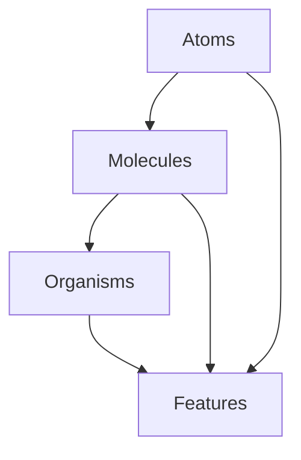

# Component Architecture

## Overview

Our component architecture follows atomic design principles, organized into a clear hierarchy that promotes reusability, maintainability, and consistency.

## Directory Structure

```
src/components/
├── core/               # Core UI components (atoms, molecules, organisms)
│   ├── atoms/         # Basic building blocks
│   ├── molecules/     # Combinations of atoms
│   ├── organisms/     # Complex UI components
│   ├── types.ts       # Shared type definitions
│   └── index.ts       # Public API
├── features/          # Feature-specific components
│   ├── auth/         # Authentication components
│   ├── onboarding/   # Onboarding components
│   └── profile/      # Profile components
└── shared/           # Shared utility components
    ├── layout/       # Layout components
    ├── navigation/   # Navigation components
    └── providers/    # Context providers
```

## Component Categories

### Core Components (Atomic Design)

1. **Atoms**
   - Basic UI elements
   - No dependencies on other components
   - Examples: Button, Input, Text, Icon

2. **Molecules**
   - Combinations of atoms
   - Simple, focused functionality
   - Examples: FormField, SearchBar, Alert

3. **Organisms**
   - Complex UI components
   - Composed of molecules and atoms
   - Examples: Form, Card, Modal

### Feature Components

- Specific to feature domains
- Can use core components
- Maintain feature-specific logic
- Examples: LoginForm, OnboardingWizard

### Shared Components

- Cross-cutting concerns
- Layout and structure
- Context providers
- Navigation elements

## Component Implementation Guidelines

### 1. File Structure

Each component should have:
```
ComponentName/
├── index.ts           # Public API
├── ComponentName.tsx  # Implementation
├── ComponentName.test.tsx  # Tests
└── README.md         # Documentation
```

### 2. Type Safety

- Use TypeScript interfaces for props
- Extend base component types
- Document prop types with JSDoc
- Export component types

### 3. Styling

- Use theme tokens
- Support dark/light modes
- Follow spacing system
- Implement responsive design
- Use StyleSheet.create

### 4. State Management

- Keep state minimal and focused
- Use hooks for complex logic
- Follow unidirectional data flow
- Document state dependencies

### 5. Testing

- Unit tests for all components
- Integration tests for features
- Accessibility testing
- Visual regression tests (future)

## Component Creation Process

1. **Planning**
   - Define component purpose
   - Identify required props
   - Plan component hierarchy
   - Consider reusability

2. **Implementation**
   - Create component structure
   - Implement core functionality
   - Add proper typing
   - Implement styling

3. **Testing**
   - Write unit tests
   - Test accessibility
   - Test edge cases
   - Performance testing

4. **Documentation**
   - Create README
   - Add JSDoc comments
   - Include usage examples
   - Document props

## Best Practices

1. **Component Design**
   - Single responsibility
   - Composable
   - Prop-driven
   - Accessible by default

2. **Code Quality**
   - Clear naming
   - Consistent patterns
   - Proper error handling
   - Performance conscious

3. **Documentation**
   - Clear purpose
   - Usage examples
   - Props documentation
   - Implementation notes

4. **Maintenance**
   - Regular updates
   - Version tracking
   - Breaking change notes
   - Deprecation notices

## Onboarding Components

For onboarding, we'll need the following components:

### Atoms
- StepIndicator
- ProgressBar
- InfoText
- ActionButton

### Molecules
- StepHeader
- InputField
- GoalSelector
- PreferenceToggle

### Organisms
- OnboardingStep
- GoalSetupForm
- PreferencesForm
- ProfileSetupForm

## Component Dependencies



## Theme Integration

All components should:
- Use theme tokens
- Support dark/light modes
- Follow Material Design 3
- Use consistent spacing

## Performance Guidelines

1. **Optimization**
   - Memoize when needed
   - Lazy load components
   - Optimize re-renders
   - Monitor bundle size

2. **Loading States**
   - Implement skeleton loading
   - Show progress indicators
   - Handle errors gracefully
   - Provide feedback

## Accessibility

1. **Requirements**
   - WCAG 2.1 compliance
   - Screen reader support
   - Keyboard navigation
   - Color contrast

2. **Implementation**
   - Semantic HTML
   - ARIA attributes
   - Focus management
   - Error announcements 