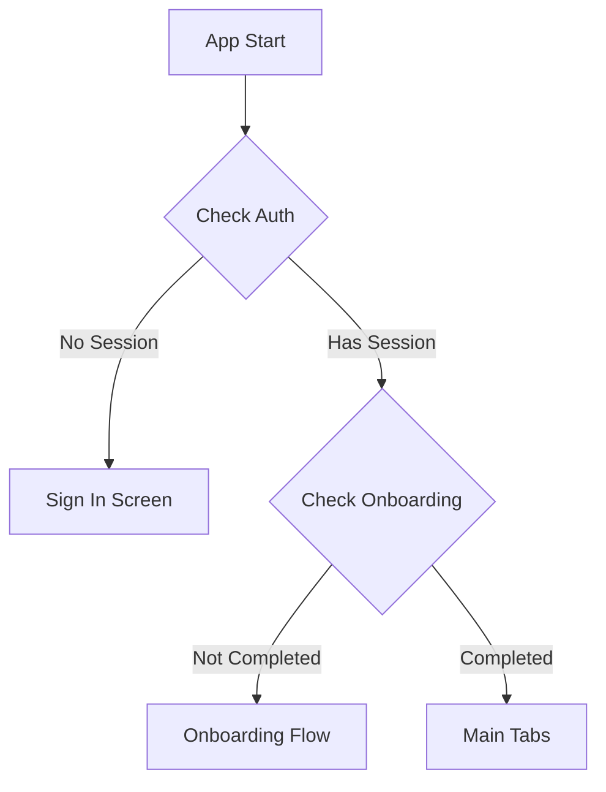
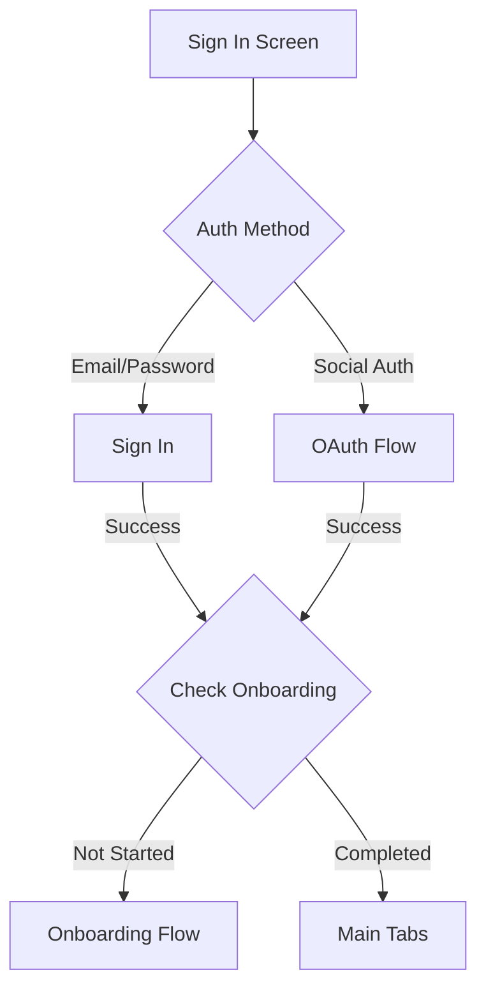
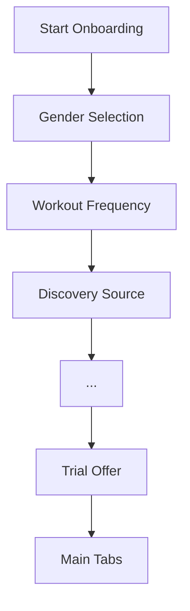
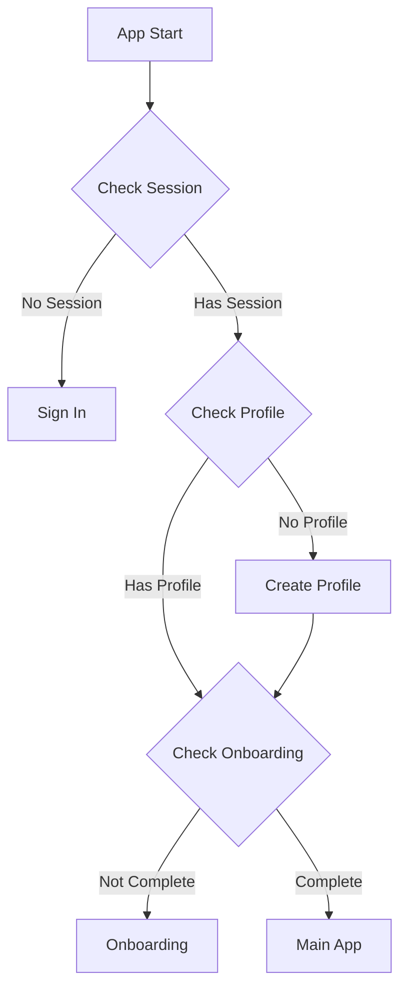

# Navigation Architecture

## Overview

This document outlines the navigation architecture for the CalTracker app, including authentication flows, onboarding, and main app navigation.

## Navigation States

The app has three main navigation states:
1. Authentication
2. Onboarding
3. Main App

## Navigation Flow Logic

### Initial App Load


### Authentication Flow


### Onboarding Flow (26 Steps)


## Route Structure

```
app/
├── index.tsx (Initial redirect)
├── (auth)/
│   ├── sign-in.tsx
│   ├── sign-up.tsx
│   ├── forgot-password.tsx
│   └── password-reset.tsx
├── (onboarding)/
│   ├── _layout.tsx
│   ├── gender.tsx
│   ├── workout-frequency.tsx
│   └── [...remaining screens]
└── (app)/
    ├── _layout.tsx (Tab navigation)
    ├── home/
    ├── meals/
    ├── insights/
    └── profile/
```

## Navigation Rules

### Authentication

1. **Initial Load**
   - App always starts at `index.tsx`
   - Redirects to `/(auth)/sign-in` by default
   - Checks for existing session

2. **Sign In/Up Success**
   - Check onboarding status
   - If not completed → Onboarding flow
   - If completed → Main tabs

3. **Password Reset**
   - Only accessible from sign-in screen
   - Returns to sign-in after completion

### Onboarding

1. **Entry Points**
   - After new sign up
   - After sign in (if not completed)

2. **Flow Control**
   - Sequential progression
   - No skipping steps
   - Back navigation disabled
   - Progress saved at each step

3. **Completion**
   - All 26 steps must be completed
   - Automatic redirect to main tabs
   - Cannot return to onboarding once completed

### Main App

1. **Access Rules**
   - Requires authenticated session
   - Requires completed onboarding
   - Persists until sign out

2. **Tab Navigation**
   - Bottom tabs for main sections
   - Preserves tab state
   - Deep linking supported

## State Management

### Auth State
```typescript
interface AuthState {
  session: Session | null;
  loading: boolean;
  error: string | null;
}
```

### Onboarding State
```typescript
interface OnboardingState {
  currentStep: number;
  totalSteps: number;
  isCompleted: boolean;
  profile: Partial<UserProfile>;
}
```

## Navigation Guards

1. **Auth Guard**
   - Checks for valid session
   - Redirects to sign-in if no session
   - Handles token refresh

2. **Onboarding Guard**
   - Checks onboarding completion
   - Redirects new users to onboarding
   - Prevents onboarding re-entry

3. **Deep Link Guard**
   - Validates deep link destinations
   - Ensures proper auth state
   - Maintains navigation stack

## Error Handling

1. **Auth Errors**
   - Invalid credentials → Stay on sign-in
   - Session expired → Return to sign-in
   - Network error → Retry with feedback

2. **Onboarding Errors**
   - Save failure → Retry with feedback
   - Navigation error → Reset to current step
   - Session loss → Save progress and redirect

3. **Deep Link Errors**
   - Invalid route → Fallback to home
   - Missing permissions → Show error
   - Bad state → Reset to safe state

## Testing Considerations

1. **Auth Flow Tests**
   - Sign in/up paths
   - Social auth integration
   - Session management
   - Error scenarios

2. **Onboarding Tests**
   - Step progression
   - Data persistence
   - Navigation rules
   - Completion states

3. **Integration Tests**
   - Full user journeys
   - State transitions
   - Deep linking
   - Error recovery

## Implementation Notes

1. **Expo Router**
   - File-based routing
   - Native navigation
   - Deep linking support
   - Type-safe routes

2. **State Management**
   - Redux for global state
   - Local state for UI
   - Persistent storage
   - State synchronization

3. **Performance**
   - Lazy loading
   - Route preloading
   - State persistence
   - Navigation optimization

## Profile-Based Navigation

### Profile State Management


### Profile Error Handling
1. **Missing Profile**
   - Automatically create profile
   - Redirect to onboarding
   - Log creation event

2. **Profile Creation Failure**
   - Retry creation once
   - Fall back to sign-in if failed
   - Log error for monitoring

3. **Profile Validation**
   - Check required fields
   - Validate data integrity
   - Handle incomplete profiles

### Navigation Guards
```typescript
// Profile guard example
async function checkProfile(userId: string) {
  try {
    const profile = await getProfile(userId);
    if (!profile) {
      return createProfile(userId);
    }
    return profile;
  } catch (error) {
    if (error.code === 'PGRST116') {
      return createProfile(userId);
    }
    throw error;
  }
}
``` 